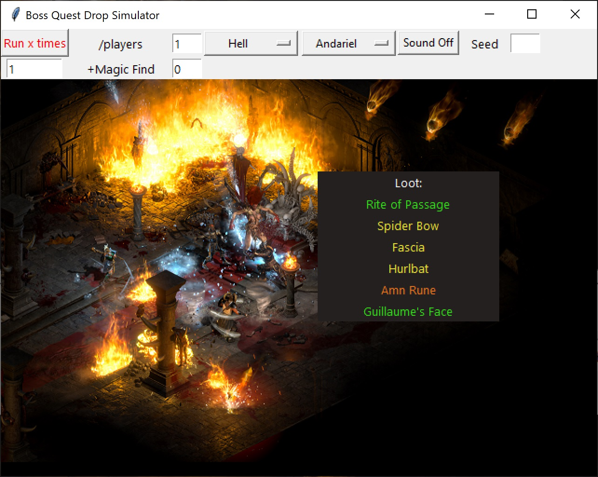

## Diablo 2 / D2R Bossq and Monster Drop Simulator 

The drop simulator uses item type and quality generating functions and data files from D2 (TreasureClassEx.txt, ItemRatio.txt, ...) to reproduce the game's random loot drop mechanic. Quest bosses and other units like Cows, Countess, Council are available.  
- The code is open source and available [here](https://github.com/search?q=repo%3Apairofdocs%2Fd2-drop-simulator+language%3APython&type=Code)
- To play, download the zip [here](https://github.com/pairofdocs/d2-drop-simulator/archive/refs/heads/master.zip) extract and double click `dropsim.exe`
- Note: Windows will complain that the app is not signed by a verified source the first time it's launched. I click on "Show more" then "Run anyway"

Each session's drops are logged to a file `session.txt`  

Will RNG drop a Shako? Vipermagi, Gheeds, Occy?  
Vampgaze, Duriels, Skullders?

### Todos
- Add Baal image
- Enable/disable check for same unique per run
- Ethereal status

### Run `x` times
Specify the number of runs to simulate with the text input field underneath the button `Run x times`. The results of the runs will be logged to the file `session.txt`. Drop sounds are disabled if the number of runs is more than 1.

### Drop Sounds
A button to toggle drop sounds enables/disables playing a sound effect while loot is 'dropped' by a boss/monster.  
D2 mp3 files from this reddit [thread](https://www.reddit.com/r/pathofexile/comments/9at2tw/d2_sounds_arranged_for_neversinks_filterblade/?utm_source=share&utm_medium=mweb&_branch_match_id=894651600463416745) are included in the `sound/` folder.  
To use one of these sound files as the app's drop sound, rename the file to `dropsound.mp3`. To use your own drop sound effect, place your mp3 sound file in `sound/` and rename it to `dropsound.mp3`.

### Random Seed
The `Seed` text input field allows setting a random number generator seed (an integer value) so that drops for a series of runs can be reproduced. The seed can only be set once for the duration of the app. If another seed is wanted the app has to be restarted.

### Modifying Drop Rates
Modding the drop rates can be done through the data files in `data-113d/`. For example: Meph's drop treasure classes and item probabilities can be edited on line 692 in [TreasureClassEx.txt](https://github.com/pairofdocs/d2-drop-simulator/blob/master/data-113d/TreasureClassEx.txt#L692). Once edited, restart dropsim.exe and test. The Phrozen Keep has this great [guide](https://d2mods.info/forum/kb/viewarticle?a=368) for TreasureClassEx.txt.

### Credits and Tools
- http://dropcalc.silospen.com/item.php
- http://mfb.bplaced.net/dropcalc/dropcalc.php?lang=en&patch=113&mode=lod&interface=default&window=true
- https://www.geeksforgeeks.org/create-first-gui-application-using-python-tkinter/
- https://d2mods.info/forum/kb/viewarticle?a=368
- https://d2mods.info/forum/kb/viewarticle?a=2
- https://d2mods.info/forum/kb/viewarticle?a=320
- https://www.purediablo.com/forums/threads/item-generation-tutorial.110/

### Copyrights
Diablo II and Diablo II: Resurrected are [copyrighted](https://www.blizzard.com/en-us/legal/9c9cb70b-d1ed-4e17-998a-16c6df46be7b/copyright-notices) by Blizzard Entertainment, Inc. All rights reserved. Diablo II, Diablo II: Resurrected and Blizzard Entertainment are [trademarks](https://www.blizzard.com/en-us/legal/9c9cb70b-d1ed-4e17-998a-16c6df46be7b/copyright-notices) or registered trademarks of Blizzard Entertainment, Inc. in the U.S. and/or other countries.  
All trademarks referenced here are the properties of their respective owners.

For the sake of convenience some text files and image files that the drop simulator requires are provided in this repository.
These files are part of the Diablo II game series and are copyrighted by Blizzard Entertainment.
They are provided only to save you the trouble of extracting them from the Diablo II game files.  
Promotional [material](https://youtu.be/DttPBtsZ5fc?t=87) from Blizzard Entertainment was used for background images in the drop simulator.

This project and its maintainers are not associated with or endorsed by Blizzard Entertainment, Inc. 
